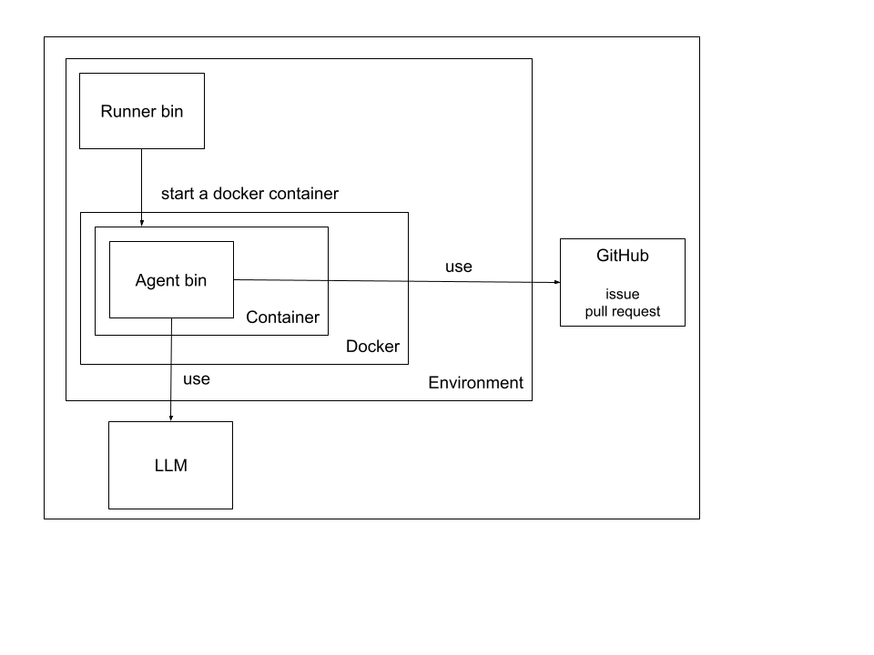

# Architecture

## Overview

1. We run runner on host machine or GitHub Actions
2. Runner starts the agent container with Docker
3. Agent container executes the agent binary
4. Agent binary communicates with LLM
5. Agent only executes the limited functions
6. Finally, agent creates a pull request to GitHub

## Runner

Runner is a program that runs the agent container simply for users.

## Use Docker Container

Containers are used to isolate the file system, processes, and other resources from the host machine.

We commonly use Docker for this purpose.

## Limited Functions

Instead of executing a shell on the agent, function calling is used to process responses from the LLM.

To prevent unintended information leakage to external sources or the execution of unsafe commands, shell execution is avoided.
